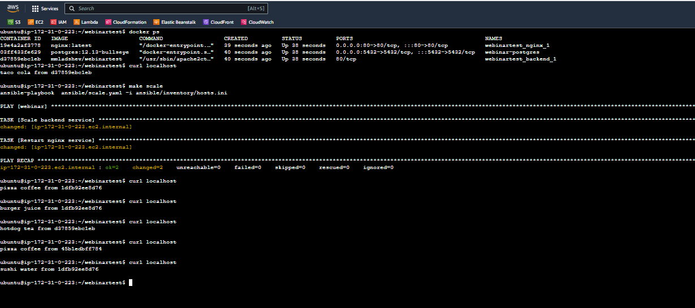

## Build image

```sh
make build
```

## Push image to DockerHub

```sh
make push
```

## Install Docker Engine

[Installation instructions](https://docs.docker.com/engine/install/ubuntu/)

Also you need add OS user to docker group

[Post-install instructions](https://docs.docker.com/engine/install/linux-postinstall/)

> You need to relogin to get this working

## Prepare server for deploy with apt-get

```bash
sudo apt-get update && sudo apt-get install -y postgresql-client python3 python3-pip libpq-dev
```

## Install on server pip deps

```bash
pip3 install docker docker-compose psycopg2
```

## Deploy project

```sh
make deploy
```

## Scale backend service

```sh
make scale
```

## Result

<p align="center">
  
</p>